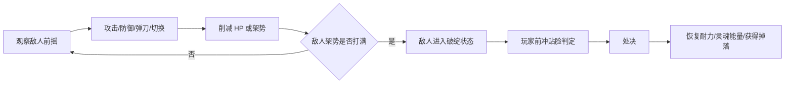

# Echo Space 游戏设计文档

版本：v0.2
最后更新：2026-05-01
适用阶段：原型期 -> Demo 期
项目类型：2D 横版平台动作 / 轻量 Metroidvania / 双世界切换 / 架势处决战斗

---

## 0. 文档定位

这份文档用于统一 `Echo Space` 后续的玩法、系统、关卡、美术、音频与开发方向。它不是一次性写完就冻结的设定集，而是随着原型验证不断更新的主设计文档。

当前版本根据 `Docs` 中新增的策划案优化建议进行了重构，重点补强以下内容：

- 双世界机制从“概念”升级为可执行的规则系统。
- 战斗从普通动作框架转向“防御、弹刀、架势、处决”的核心循环。
- 关卡节奏从单点谜题扩展为教学、练习、高潮、回收的完整节奏。
- 敌人与能力设计增加可复用模板，方便后续持续扩展。
- 增加作品集包装思路，使项目既能落地 Demo，也能展示设计与实现能力。

---

## 1. 项目概述

### 1.1 项目名称

- 名称：`Echo Space`
- 中文暂定名：`双界回响`

### 1.2 类型定位

`Echo Space` 是一款 2D 横版平台动作游戏，带有轻量 Metroidvania 探索结构。玩家操控一名能在“现实世界”和“灵魂世界”之间切换的角色，在长横向、多层级的关卡中探索、战斗、解谜，并通过双世界机制打开道路。

### 1.3 核心一句话

玩家通过实时切换现实与灵魂两个世界，改变场景、敌人与机关的状态，并利用精准弹刀积累敌人架势，抓住破绽完成处决。

### 1.4 目标平台

- 首发目标：PC Windows
- 引擎：Godot 4.6.2
- 编程语言：C#
- 开发模式：单人全栈

### 1.5 项目目标

短期目标是完成一个可完整游玩的 20 到 30 分钟 Demo。Demo 需要展示：

- 稳定的横版移动与镜头跟随。
- 可理解、可利用、可反复验证的双世界切换。
- 基于防御、弹刀、架势与处决的战斗闭环。
- 至少一个完整白盒关卡区域。
- 至少三类敌人与一类 Boss 或精英敌人原型。
- 至少一套可扩展的背包、加点、敌人基类、双世界物体基类。

---

## 2. 设计支柱

### 2.1 双世界不是滤镜，而是规则变化

现实世界与灵魂世界必须在路径、敌人、机关、物理或信息层面产生实质差异。世界切换不能只改变画面颜色，而应该改变玩家能做什么、不能做什么，以及为什么要切换。

设计标准：

- 每个关键障碍至少 60% 的解法价值来自双世界切换。
- 如果某个谜题不切世界也能几乎完整解决，就应降低其优先级或重做。
- 双世界差异必须可被玩家观察、学习和预测。

### 2.2 战斗核心是“看懂攻击，然后回应”

战斗不是数值碾压，而是观察敌人动作、判断前摇、选择攻击、防御、弹刀或切换世界。

玩家最重要的成功感来自：

- 看懂敌人攻击节奏。
- 在正确时机弹刀。
- 打满敌人架势条。
- 进入破绽状态。
- 前冲贴脸并处决。

### 2.3 探索核心是“同一空间的两种答案”

关卡不是简单左右推进，而是利用双世界为同一地点提供两套空间逻辑。

现实世界更偏物理、稳定、可操作；灵魂世界更偏记忆、虚影、危险和隐藏路径。

### 2.4 成长应服务机制，而不是替代机制

背包、属性与技能成长可以让玩家更强，但不能让玩家绕过核心玩法。升级可以提高容错率、改变打法倾向，但 Boss 与精英敌人仍应要求玩家理解弹刀、架势和双世界机制。

---

## 3. 目标玩家与体验关键词

### 3.1 目标玩家

- 喜欢 2D 横版动作和类银河战士恶魔城探索的玩家。
- 喜欢只狼式“弹刀、压迫、处决”节奏的玩家。
- 喜欢在同一空间中发现隐藏规则、隐藏道路的玩家。
- 能接受轻量叙事、环境叙事和逐步解锁能力的玩家。

### 3.2 体验关键词

- 紧张但可读。
- 神秘但不混乱。
- 失败后知道自己错在哪里。
- 切换世界时有“空间被重新解释”的感觉。
- 处决时有强烈的重量感、回报感和节奏释放。

---

## 4. 世界观与叙事框架

### 4.1 玩家身份

玩家角色是“灵魂回响者”。一次灾变使他的身体与灵魂不再完全重合，他被卡在现实与灵魂世界的缝隙中，因此能主动切换两个世界。

这个身份解释了三件事：

- 为什么玩家能切换世界。
- 为什么现实与灵魂世界都会回应玩家行动。
- 为什么玩家通过处决、记忆碎片和界碑能逐步稳定自身能力。

### 4.2 世界设定

世界中存在名为“界碑”的稳定设施。界碑原本用于维持现实与灵魂世界的边界，但灾变后界碑被污染、破损或失控，导致两个世界出现重叠、错位和互相侵蚀。

玩家的主线目标是调查灾变源头，修复或重构界碑系统，并最终决定两个世界的未来。

### 4.3 主线结构

1. 初始阶段：玩家在边界破裂后的废墟中醒来，学习移动、攻击、防御、弹刀和切换世界。
2. 调查阶段：玩家发现界碑失控，现实空间与灵魂记忆互相污染。
3. 修复阶段：玩家击败区域守卫，逐步恢复界碑功能，解锁新能力。
4. 真相阶段：玩家发现界碑不是单纯的保护设施，也曾被用于压制灵魂世界。
5. 结局选择：封闭裂隙、维持不稳定平衡、或重构新的双界秩序。

### 4.4 叙事载体

- 核心道具：破碎家徽、锈蚀钥匙、界碑残片、记忆核心。
- 环境叙事：现实中的废墟在灵魂世界变成过去事件的残影。
- 记忆碎片：可收集的短文本、画面残像或 NPC 灵魂对话。
- Boss 记忆：处决 Boss 后释放区域真相。

---

## 5. 核心循环

### 5.1 基础循环

### 5.2 战斗循环

### 5.3 双世界循环

---

## 6. 双世界机制设计

### 6.1 世界定义

| 维度 | 现实世界 | 灵魂世界 |
| --- | --- | --- |
| 视觉 | 暖色、写实、破败、厚重 | 冷色、半透明、发光、流动 |
| 物理 | 稳定、重力正常、碰撞可靠 | 部分平台虚化、重力可降低、危险记忆显现 |
| 机关 | 按钮、拉杆、门、机械结构可操作 | 部分机关不可见，或转化为灵魂符文 |
| 敌人 | 实体敌人，可被物理攻击 | 灵体敌人、变体敌人、隐藏弱点 |
| 信息 | 当前现实状态 | 过去记忆、隐藏路径、真实原因 |

### 6.2 权威世界与状态同步

为了避免双世界状态混乱，本项目采用“统一管理、切换刷新”的模型。

设计原则：

- `WorldManager` 是当前世界状态的唯一权威来源。
- 所有双世界对象注册到 `WorldManager`。
- 世界切换时统一广播事件，而不是每帧轮询。
- 对象自身保存现实状态和灵魂状态两个数据块。
- 切换时对象根据当前世界刷新可见性、碰撞、交互、动画和位置偏移。

### 6.3 双轨状态模型

每个双世界物体应具备类似结构：

| 字段 | 说明 |
| --- | --- |
| `ExistsInReality` | 是否存在于现实世界 |
| `ExistsInSoul` | 是否存在于灵魂世界 |
| `RealityState.IsBroken` | 现实世界破坏状态 |
| `SoulState.IsBroken` | 灵魂世界破坏状态 |
| `RealityState.IsActivated` | 现实世界激活状态 |
| `SoulState.IsActivated` | 灵魂世界激活状态 |
| `RealityOffset` | 现实世界位置偏移 |
| `SoulOffset` | 灵魂世界位置偏移 |
| `SharedHealth` | 是否两世界共享生命 |
| `SharedPosture` | 是否两世界共享架势 |

### 6.4 切换成本

如果世界切换没有成本，玩家可能会把它当作万能钥匙反复乱按。因此需要引入轻量限制。

当前建议：

| 规则 | 初始值 | 目的 |
| --- | --- | --- |
| 切换冷却 | 0.5 秒 | 避免高速抖动切换 |
| 灵魂能量消耗 | 每次切换消耗少量 | 让切换成为策略选择 |
| 灵魂能量恢复 | 随时间缓慢恢复 | 避免玩家彻底卡死 |
| 处决恢复 | 处决后大幅恢复 | 把战斗胜利与探索资源连起来 |

原型阶段可以先只做冷却，等战斗、UI 与关卡稳定后再接入灵魂能量。

### 6.5 差异规则库

后续设计谜题和敌人时，应优先从以下规则中组合，而不是临时硬写特殊逻辑。

| 规则类型 | 现实世界 | 灵魂世界 | 用途 |
| --- | --- | --- | --- |
| 存在差异 | 物体存在 | 物体消失或虚化 | 打开隐藏路径 |
| 碰撞差异 | 可站立 | 可穿过 | 平台谜题 |
| 位置差异 | 平台较低 | 平台较高 | 跳跃路线 |
| 运动差异 | 平台静止 | 平台移动 | 时机谜题 |
| 方向差异 | 轨道正向 | 轨道反向 | 返程或捷径 |
| 重力差异 | 正常重力 | 低重力或滞空 | 高度探索 |
| 时间差异 | 正常速度 | 局部慢速 | 躲避机关 |
| 元素差异 | 火焰造成伤害 | 灵火可穿越 | 环境转换 |
| 敌态差异 | 可攻击实体 | 无敌灵体或狂暴形态 | 战斗决策 |
| 信息差异 | 看见结果 | 看见原因 | 叙事与解谜 |

### 6.6 “必须切换”检查清单

每个关键谜题上线前要检查：

- 玩家是否能在不切世界的情况下解决？如果可以，切换价值是否低于 60%？
- 两个世界的差异是否能被画面、音效或 UI 清楚表达？
- 玩家是否有安全空间观察差异？
- 玩家失败后是否能知道失败原因？
- 该谜题是否复用了已有规则，还是引入了过多一次性规则？
- 解法是否能支持正向推进、返程捷径或隐藏奖励中的至少一种？

---

## 7. 战斗系统设计

### 7.1 核心资源

| 对象 | 资源 | 作用 |
| --- | --- | --- |
| 玩家 | HP | 归零死亡或重生 |
| 玩家 | 耐力 | 攻击、防御、弹刀、冲刺等动作消耗 |
| 玩家 | 灵魂能量 | 后续用于世界切换、灵魂技能 |
| 敌人 | HP | 归零死亡 |
| 敌人 | 架势 | 打满后进入破绽状态，可被处决 |

### 7.2 防御与弹刀

玩家右键进入防御或弹刀输入。设计上分为两种结果：

| 行为 | 条件 | 效果 |
| --- | --- | --- |
| 完美弹刀 | 敌人命中前约 0.1 秒内输入 | 大幅削减敌人架势，不受 HP 伤害，不消耗或少量消耗耐力 |
| 普通防御 | 按住防御但不在完美窗口 | 阻挡部分或全部伤害，消耗较多耐力，少量削减敌人架势 |
| 防御失败 | 未防御或耐力不足 | 玩家受 HP 伤害，并可能增加自身硬直 |

初始弹刀窗口建议：

- 完美弹刀窗口：约 6 帧，60 FPS 下约 0.1 秒。
- 普通防御窗口：只要防御状态存在且方向有效即可。
- 敌人攻击前摇必须明显，避免玩家只能靠背板。

### 7.3 架势数值原型

以下数值仅用于原型阶段，后续应外置为配置表。

| 事件 | 敌人架势变化 | 玩家耐力变化 | 说明 |
| --- | --- | --- | --- |
| 玩家普通攻击命中 | +15 | -少量 | 稳定推进架势，但效率不如弹刀 |
| 完美弹刀 | +40 | 0 或 -极少 | 核心奖励行为 |
| 普通防御 | +5 | -中等 | 给保守玩家最低收益 |
| 玩家被命中 | 0 | -较多或中断恢复 | 惩罚失误 |
| 重攻击命中 | +25 到 +35 | -较多 | 后续用于破盾或打重甲 |

### 7.4 破绽与处决

当敌人架势条打满时，敌人进入破绽状态。

破绽状态规则：

- 敌人停止普通 AI。
- 敌人头顶显示明显处决标志。
- 敌人进入短暂硬直或跪地动画。
- 玩家需要在有效距离内按攻击键触发处决。
- 若玩家距离略远，可触发短距离前冲贴脸判定。

处决不只是击杀，它也是资源循环节点：

- 恢复玩家耐力。
- 后续可恢复灵魂能量。
- 可触发短暂停顿、镜头震动、特效和音效强调。
- 可让周围低级敌人短暂恐惧、后退或硬直。
- 可掉落材料、恢复物或记忆碎片。

### 7.5 战斗节奏目标

| 对象 | 目标节奏 |
| --- | --- |
| 普通敌人 | 15 到 25 秒内解决 |
| 精英敌人 | 45 到 90 秒，要求学习招式 |
| Boss | 8 到 12 次处决循环内完成 |
| 玩家容错 | 同等级普通敌人命中 4 到 6 次后死亡 |

### 7.6 成长与数值边界

成长系统应提高容错和风格差异，不应删除技巧要求。

| 属性 | 主要效果 | 边界 |
| --- | --- | --- |
| 生命 | 提高 HP 上限 | 不能让玩家无视 Boss 机制 |
| 耐力 | 提高连续攻击、防御和机动能力 | 不能无限防御 |
| 力量 | 提高 HP 伤害，少量提高架势伤害 | 不能替代弹刀 |
| 弹反 | 提高弹刀收益，轻微增加弹刀窗口 | 每 5 点最多约 +1 帧 |
| 灵魂共鸣 | 提高灵魂世界伤害、减伤或能量上限 | 需要递减收益 |

建议使用递减收益或分段成长，避免后期数值完全压过机制。

---

## 8. 玩家能力设计

### 8.1 初始能力

- 左右移动。
- 跳跃。
- 基础攻击。
- 防御 / 弹刀。
- 世界切换。
- 与机关交互。

### 8.2 中期能力候选

| 能力 | 用途 | 解锁后立即验证方式 |
| --- | --- | --- |
| 灵魂牵引 | 拉向灵魂锚点，兼具位移与战斗接近 | 新路线、旧区域捷径、战斗追击 |
| 蓄力重击 | 高架势伤害，破盾或破甲 | 重甲敌人、可破坏墙、Boss 弱点 |
| 二段跳 | 扩展纵向探索 | 双世界平台组合、隐藏收集 |
| 下砸 | 打碎脆弱地面，震晕轻敌 | 灵魂裂地、地下捷径、战斗控场 |
| 灵魂滞空 | 灵魂世界短暂减速下落 | 低重力平台、弹幕规避 |

### 8.3 能力与锁钥关系

每个能力都必须避免成为“一把钥匙开一扇门”的一次性功能。能力解锁后至少要服务三类内容：

- 主线推进。
- 旧区域回收。
- 战斗策略或隐藏奖励。

示例：

| 能力 | 主线用途 | 回收用途 | 战斗用途 |
| --- | --- | --- | --- |
| 灵魂牵引 | 跨越灵魂裂隙 | 返回旧区域高处宝箱 | 快速贴近远程敌人 |
| 蓄力重击 | 破开重甲门 | 打碎旧区灵魂墙 | 打断盾兵防御 |
| 二段跳 | 到达上层平台 | 获取早期看得到拿不到的道具 | 躲避低位横扫 |
| 下砸 | 打穿脆弱地板 | 开启地下捷径 | 震晕轻型敌人 |

---

## 9. 关卡与探索设计

### 9.1 地图结构方向

地图最终方向是长横向、多层级结构。一个区域通常由上下两到三层构成，镜头跟随玩家移动。

基础结构：

- 主路径横向推进。
- 上层放置隐藏奖励、绕路捷径、风险路线。
- 下层放置危险区域、资源回收、支线挑战。
- 通过双世界切换改变层级之间的连接关系。

### 9.2 难度节奏

推荐使用锯齿形节奏：

### 9.3 机制教学循环

每个新机制都应经历：

1. 安全展示：玩家不会死亡，只观察机制。
2. 低压练习：单一机制，没有敌人或只有弱敌。
3. 标准挑战：机制与平台跳跃或敌人结合。
4. 综合考核：机制与旧机制组合。
5. 回收奖励：玩家在旧区域使用新机制获得奖励。

### 9.4 双世界谜题示例

#### 谜题 1：箱子与钥匙

- 现实世界：钥匙在箱子后方，箱子无法移动。
- 灵魂世界：箱子变成灵魂残影，可以被推动或破坏。
- 解法：切换灵魂世界移开箱子，再回现实取得钥匙。

#### 谜题 2：移动平台

- 现实世界：平台静止且可站立。
- 灵魂世界：平台沿轨道移动。
- 解法：现实世界跳上平台，切换灵魂世界移动，接近目标后切回现实稳定落点。

#### 谜题 3：灵魂墙

- 现实世界：墙体完整但无法破坏。
- 灵魂世界：墙体显示裂纹，可被蓄力重击破坏。
- 解法：灵魂世界破坏墙后打开灵魂路径，现实世界仍保留墙体，形成双路径结构。

---

## 10. 敌人设计

### 10.1 敌人基类目标

所有敌人应尽量复用同一套基础战斗结构：

- HP。
- 架势。
- 受击。
- 破绽。
- 处决。
- 世界切换响应。
- 掉落。
- 基础 AI 状态机。

具体敌人只扩展移动方式、攻击方式、双世界差异和特殊行为。

### 10.2 敌人生态表

| 敌人 | 现实世界 | 灵魂世界 | 教学目标 |
| --- | --- | --- | --- |
| 徘徊残躯 | 慢速巡逻，明显挥击，可弹刀 | 半透明哀嚎灵体，移动更快，接触爆裂 | 教玩家读前摇与基础弹刀 |
| 灵魂突进体 | 黑雾残影，移动慢，普通攻击难命中 | 高速冲刺敌人，可通过切回现实规避 | 教玩家用切世界躲攻击 |
| 晶化投掷者 | 投掷直线晶体，可防御或跳躲 | 发射慢速追踪灵弹 | 教玩家处理远程压力 |
| 重甲守卫 | 持盾格挡，重击前摇长 | 狂暴无盾，攻击范围更大 | 教玩家蓄力重击与高压弹刀 |
| 边界看守 | 双世界都存在，但弱点不同 | 攻击节奏改变，架势共享 | 精英敌人，考核切换与弹刀 |

### 10.3 敌人模板

新增敌人时需要填写：

| 项目 | 内容 |
| --- | --- |
| 名称 | 敌人中文名与脚本名 |
| 角色定位 | 教学敌、压力敌、远程敌、精英敌、Boss |
| 现实状态 | 外观、移动、攻击、弱点 |
| 灵魂状态 | 外观、移动、攻击、弱点 |
| HP | 初始生命 |
| 架势 | 初始架势上限 |
| 攻击前摇 | 玩家可读时间 |
| 弹刀收益 | 成功弹刀造成的架势伤害 |
| 破绽时间 | 架势打满后可处决窗口 |
| 掉落 | 材料、恢复物、记忆 |
| 关卡用途 | 它验证什么机制 |

---

## 11. 示例区域：沉没档案馆

### 11.1 区域概念

现实世界中的“沉没档案馆”是一座半淹没的古代资料库，木架腐烂，石墙渗水，许多道路被积水阻断。

灵魂世界中的档案馆则像一片由记忆、文字和水流组成的海。书页悬浮，数据碎片像鱼群一样游动，某些被遗忘的记录会短暂显现为平台。

### 11.2 视觉方向

| 世界 | 视觉关键词 |
| --- | --- |
| 现实 | 潮湿、旧木、石墙、水光、锈蚀金属、昏黄灯火 |
| 灵魂 | 幽蓝、荧光绿、漂浮书页、半透明平台、流动文字 |

### 11.3 区域节奏

1. 平静探索：现实世界中通过浅水和书架前进，灵魂世界显示隐藏平台。
2. 教学走廊：玩家遇到徘徊残躯，切换灵魂世界可看到其灵魂形态。
3. 组合挑战：平台跳跃、晶化投掷者、灵魂牵引锚点组合出现。
4. 捷径回收：启动水泵后现实世界水位下降，灵魂世界水面结晶成桥。
5. Boss：档案执念体。

### 11.4 Boss 概念：档案执念体

- 第一阶段现实形态：由书架、石板和锁链组成的沉重巨像，攻击慢但范围大。
- 第二阶段灵魂形态：由书页、墨水和记忆残影组成的高速灵体，攻击更密集。
- 核心考核：玩家需要在两个世界中识别不同安全区，并通过弹刀打出架势破绽。

---

## 12. 背包与加点系统

### 12.1 背包系统目标

背包不是复杂 RPG 管理，而是服务探索、恢复和解谜。

物品类型：

- 消耗品：恢复药、临时耐力药、灵魂能量碎片。
- 钥匙物品：区域钥匙、界碑碎片、剧情道具。
- 材料：敌人掉落、可用于升级或制作。
- 记忆碎片：叙事收集。

### 12.2 加点系统目标

加点用于让玩家形成轻量构筑倾向。

初始属性建议：

| 属性 | 功能 |
| --- | --- |
| 生命 | 提高 HP 上限 |
| 耐力 | 提高连续行动和防御容错 |
| 力量 | 提高直接 HP 伤害 |
| 弹反 | 提高弹刀奖励，轻微扩大弹刀窗口 |
| 灵魂共鸣 | 强化灵魂世界相关收益 |

### 12.3 UI 层级规则

背包、加点、设置、暂停菜单都属于二级界面。后续新增二级界面应遵守：

- 界面居中显示。
- 新界面打开时，旧界面不销毁，只压到下层。
- 关闭当前界面后，下层界面重新显露。
- 界面栈由统一 UI 管理器维护。
- 游戏输入与 UI 输入需要分层，避免打开 UI 后角色继续移动。

---

## 13. UI 与交互反馈

### 13.1 常驻 HUD

左上角当前只保留核心战斗资源：

- 玩家 HP 条。
- 玩家耐力条。

敌人头顶显示：

- HP 条。
- 架势条。
- 破绽 / 可处决标志。

### 13.2 世界提示

世界状态需要清晰但不抢画面。建议通过：

- 屏幕色调。
- 角色材质或轮廓。
- 背景后处理。
- 小型世界图标。
- 切换音效。

### 13.3 战斗反馈

| 事件 | 反馈 |
| --- | --- |
| 普通命中 | 小火花、轻微停顿 |
| 完美弹刀 | 强烈火花、音效突出、短暂停顿、敌人架势明显增加 |
| 普通防御 | 较闷的格挡音，耐力下降 |
| 架势打满 | 敌人进入跪地或眩晕，标志出现 |
| 处决 | 慢动作、镜头微缩放、重音、资源恢复 |

---

## 14. 美术与音频方向

### 14.1 现实世界美术

关键词：

- 赭石。
- 深木色。
- 潮湿绿反光。
- 裂石。
- 腐木。
- 锈蚀金属。
- 清晰主光源与局部点光。

现实世界应让玩家感到可触摸、有重量、有腐败痕迹。

### 14.2 灵魂世界美术

关键词：

- 幽蓝。
- 紫灰。
- 荧光绿。
- 半透明。
- 发光边缘。
- 流动材质。
- 模糊阴影。
- 画面轻微扭曲。

灵魂世界应让玩家感到空间不稳定、记忆残留、危险但迷人。

### 14.3 切换特效

世界切换应包含：

- 色差分离。
- 屏幕波纹。
- 背景短暂错位。
- 角色轮廓闪烁。
- 短暂停顿或时间压缩感。

### 14.4 音频方向

| 事件 | 现实世界 | 灵魂世界 |
| --- | --- | --- |
| 弹刀 | 金属碰撞、清脆、有重量 | 玻璃碎裂、能量共鸣 |
| 切换到灵魂 | 低频抽离，高频耳鸣，空间变空 | 进入混响与漂浮声场 |
| 切回现实 | 低频回归，落地感增强 | 声音重新变厚 |
| 处决 | 重击、短暂停顿、音乐重音 | 可加入灵魂尖啸或记忆释放 |

---

## 15. 技术系统映射

### 15.1 已规划核心模块

| 模块 | 目标 |
| --- | --- |
| PlayerController | 玩家移动、攻击、防御、受伤、资源 |
| EnemyCombatController | 敌人 HP、架势、受击、死亡、破绽 |
| EnemyController 派生类 | 巡逻、追击、远程、特殊敌人 |
| WorldManager | 当前世界状态、切换广播 |
| DualWorldObject | 双世界物体状态 |
| ObjectPool | 子弹、特效、音频播放器复用 |
| UIStackManager | 二级界面层级与关闭恢复 |
| InventoryManager | 背包数据 |
| StatAllocationManager | 加点数据 |

### 15.2 状态机方向

玩家、敌人和机关都应逐步迁移到有限状态机结构。

示例状态：

| 对象 | 状态 |
| --- | --- |
| 玩家 | Idle、Run、Jump、Fall、Attack、Guard、Parry、Hurt、Execute、Dead |
| 敌人 | Patrol、Chase、Windup、Attack、Recover、Hurt、Vulnerable、Dead |
| 机关 | Idle、Active、Cooldown、Broken |

### 15.3 数据外置方向

后续数值应逐步从脚本常量迁移到资源或配置表：

- 玩家基础属性。
- 敌人 HP / 架势 / 伤害。
- 攻击前摇与判定时间。
- 世界切换冷却和能量消耗。
- 物品效果。
- 加点成长曲线。

---

## 16. 存档策略

当前阶段存档系统已暂缓，因为玩法系统仍在快速变化。等基础玩法稳定后再设计统一存档，避免重复返工。

未来存档需要覆盖：

- 玩家位置。
- 当前世界。
- 玩家 HP、耐力、灵魂能量。
- 背包物品。
- 加点数据。
- 已击杀敌人。
- 已破坏双世界物体。
- 已激活机关。
- 已解锁能力。
- 已收集记忆碎片。

设计原则：

- 场景临时状态与永久进度分离。
- 敌人死亡、机关激活、双世界破坏状态需要唯一 ID。
- 即时读档必须完整恢复输入、UI、暂停状态和角色控制权。

---

## 17. 平衡框架

### 17.1 原型平衡目标

| 项目 | 建议值 |
| --- | --- |
| 输入缓冲 | 0.12 秒 |
| Coyote Time | 0.10 秒 |
| 弹刀窗口 | 约 0.10 秒 |
| 世界切换冷却 | 0.50 秒 |
| 普通敌人战斗时长 | 15 到 25 秒 |
| 玩家承受普通敌人命中 | 4 到 6 次 |
| Boss 处决循环 | 8 到 12 次 |

### 17.2 隐性动态难度候选

如果后续测试显示挫败感过强，可以加入非常轻量的隐性动态调整：

- 玩家连续死亡后，提高恢复物掉落概率。
- 玩家连续死亡后，略微降低当前房间敌人 HP。
- 不直接提示玩家，避免削弱成就感。

该系统不是当前优先级，仅作为后期调优方案。

---

## 18. 内容范围

### 18.1 Demo 目标内容

- 1 个主区域。
- 1 个教学区。
- 1 个标准探索区。
- 1 个精英战或 Boss 原型。
- 3 到 5 种双世界谜题。
- 3 种普通敌人。
- 1 种精英敌人。
- 1 到 2 个新能力。
- 背包和加点 UI 原型。

### 18.2 暂不纳入 Demo 的内容

- 完整商业级美术。
- 大规模剧情演出。
- 多结局完整实现。
- 完整经济系统。
- 大量装备词条。
- 复杂 NPC 任务链。

---

## 19. 开发路线

### 19.1 第一阶段：核心可玩

- 玩家移动、跳跃、攻击、防御、弹刀。
- HP 与耐力 UI。
- 敌人 HP、架势、破绽、处决。
- 双世界切换与双世界物体。
- 第一个可破坏墙与基础机关。

### 19.2 第二阶段：系统骨架

- 敌人战斗基类。
- 背包框架。
- 加点框架。
- UI 界面栈。
- 对象池。
- 配置表雏形。

### 19.3 第三阶段：关卡白盒

- 长横向地图。
- 上下两到三层结构。
- 镜头跟随与边界。
- 双世界平台、门、墙、机关组合。
- 教学、练习、高潮、捷径节奏。

### 19.4 第四阶段：内容扩展

- 第二、第三类敌人。
- 至少一个精英敌人。
- 灵魂牵引或二段跳。
- 区域奖励与回收路线。
- 叙事碎片。

### 19.5 第五阶段：打磨与包装

- 战斗手感调优。
- 双世界切换特效。
- 音效占位与最终替换。
- UI 美术替换。
- README、设计文档、截图、演示视频整理。

---

## 20. 作品集包装策略

这个项目除了作为游戏 Demo，也应被包装成能展示设计与工程能力的作品集项目。

### 20.1 展示重点

- 一个明确的核心机制：双世界切换。
- 一个明确的战斗方向：弹刀、架势、处决。
- 一个可扩展工程结构：敌人基类、双世界物体、UI 栈、背包、加点。
- 一个完整设计过程：从概念到规则，从规则到原型，从原型到迭代。

### 20.2 README 展示建议

README 后续可以包含：

- 核心玩法 GIF。
- 双世界切换 GIF。
- 弹刀与处决 GIF。
- 关卡白盒截图。
- 系统架构图。
- 当前完成度。
- 人工资源填充清单。

### 20.3 设计决策记录

后续文档中建议保留“为什么这样设计”的说明，例如：

- 为什么世界切换需要冷却或灵魂能量。
- 为什么关键谜题要求 60% 以上解法价值来自双世界。
- 为什么成长系统使用递减收益。
- 为什么普通攻击削架势较少，弹刀削架势较高。
- 为什么存档系统暂缓。

这类内容非常适合在作品集和面试中展示思考过程。

---

## 21. 风险与应对

| 风险 | 应对 |
| --- | --- |
| 双世界对象过多导致同步混乱 | 统一由 WorldManager 广播，不做每帧轮询 |
| 世界切换变成万能钥匙 | 加入冷却、能量或场景限制 |
| 战斗像普通砍怪，缺少弹刀核心 | 提高弹刀架势收益，降低普攻架势收益 |
| 成长系统破坏技巧要求 | 使用递减收益，Boss 仍考核机制 |
| 关卡设计工作量过大 | 先白盒，后美术替换 |
| UI 系统随着背包、加点、设置膨胀 | 使用统一 UI 栈管理 |
| 存档系统过早导致返工 | 暂缓到玩法 ID 与进度结构稳定后 |
| 美术音乐资源不足 | README 持续维护人工资源填充清单 |

---

## 22. 当前最适合推进的方向

按当前项目状态，建议接下来优先级为：

1. 将双世界机关从单个可破坏墙扩展到按钮门、移动平台、灵魂平台。
2. 完成更长的横向白盒关卡，上下两到三层，并让镜头边界稳定。
3. 继续复测弹刀、架势、处决，确保普通攻击、弹刀、处决收益清晰。
4. 做第二类正式敌人，验证敌人战斗基类是否足够复用。
5. 接入一个新能力原型，优先考虑灵魂牵引或蓄力重击。
6. 等双世界物体和敌人唯一 ID 稳定后，再重新设计存档系统。

---

## 23. 附录：设计模板

### 23.1 双世界物体模板

| 项目 | 内容 |
| --- | --- |
| 物体名称 |  |
| 现实是否存在 |  |
| 灵魂是否存在 |  |
| 现实碰撞 |  |
| 灵魂碰撞 |  |
| 现实交互 |  |
| 灵魂交互 |  |
| 是否可破坏 |  |
| 是否共享状态 |  |
| 谜题用途 |  |

### 23.2 敌人设计模板

| 项目 | 内容 |
| --- | --- |
| 敌人名称 |  |
| 敌人定位 |  |
| 现实形态 |  |
| 灵魂形态 |  |
| HP |  |
| 架势 |  |
| 攻击方式 |  |
| 攻击前摇 |  |
| 弹刀反馈 |  |
| 破绽时间 |  |
| 掉落 |  |
| 教学目标 |  |

### 23.3 能力设计模板

| 项目 | 内容 |
| --- | --- |
| 能力名称 |  |
| 解锁位置 |  |
| 主线用途 |  |
| 旧区域回收用途 |  |
| 战斗用途 |  |
| UI 提示 |  |
| 风险 |  |

### 23.4 区域设计模板

| 项目 | 内容 |
| --- | --- |
| 区域名称 |  |
| 现实视觉 |  |
| 灵魂视觉 |  |
| 核心机制 |  |
| 新敌人 |  |
| 新能力 |  |
| 教学段 |  |
| 练习段 |  |
| 高潮段 |  |
| 捷径 |  |
| Boss / 精英战 |  |

---

## 24. 结语

`Echo Space` 的核心不是“两个世界看起来不同”，而是“同一个空间在两个世界中拥有不同答案”。战斗也不是单纯攻击敌人，而是观察、回应、压制、处决。

后续开发应始终围绕三个问题检查方向：

- 这个内容是否让双世界机制更有意义？
- 这个敌人或战斗是否鼓励玩家理解弹刀与架势？
- 这个系统是否能服务 Demo 落地，而不是扩大不可控范围？

只要这三点保持清晰，项目就可以稳步从白盒原型推进到一个完整、有辨识度、适合作品集展示的 2D 动作 Demo。
